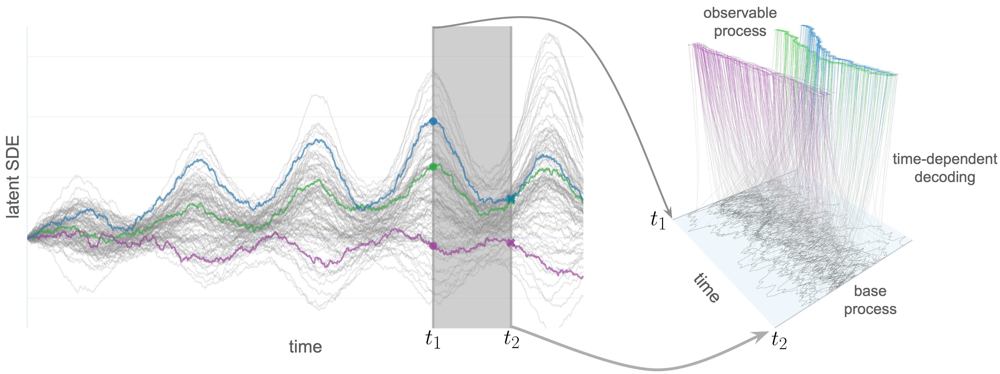

# Continuous Latent Process Flows



## About

Code, data, and pre-trained models for the paper

> Ruizhi Deng, Marcus Brubaker, Greg Mori, Andreas Lehrmann. "Continuous Latent Process Flows" (NeurIPS 2021)
[[arXiv]](https://arxiv.org/pdf/2106.15580.pdf)[[OpenReview]](https://openreview.net/forum?id=KzYIEQ_B1BX&referrer=%5BAuthor%20Console%5D(%2Fgroup%3Fid%3DNeurIPS.cc%2F2021%2FConference%2FAuthors%23your-submissions))


## Environment setup

Use the script ``env_setup.sh`` to set up your environment. cudatoolkit of version 11.0 is also used in our setup. Please consider using the appropriate version of cudatoolkit for your environment.

## Acknowlegements
The code make uses of code from the following projects:

https://github.com/BorealisAI/continuous-time-flow-process
for the paper
> Ruizhi Deng, Bo Chang, Marcus Brubaker, Greg Mori, Andreas Lehrmann. "Modeling Continuous Stochastic Process with Dynamic Normalizing Flow" (NeurIPS 2020).
[[arXiv]](https://arxiv.org/pdf/2002.10516.pdf)

https://github.com/YuliaRubanova/latent_ode
for the paper
> Yulia Rubanova, Ricky Chen, David Duvenaud. "Latent ODEs for Irregularly-Sampled Time Series" (NeurIPS 2019).
[[arXiv]](https://arxiv.org/abs/1907.03907)

https://github.com/rtqichen/ffjord
for the paper
> Will Grathwohl*, Ricky T. Q. Chen*, Jesse Bettencourt, Ilya Sutskever, David Duvenaud. "FFJORD: Free-form Continuous Dynamics for Scalable Reversible Generative Models" (ICLR 2019).
> [[arXiv]](https://arxiv.org/abs/1810.01367)

https://github.com/rtqichen/residual-flows
for the paper
> Ricky T. Q. Chen, Jens Behrmann, David Duvenaud, Jörn-Henrik Jacobsen. "Residual Flows for Invertible Generative Modeling" (NeurIPS 2019).
> [[arXiv]](https://arxiv.org/abs/1906.02735)

## Data preparation
Download simulated synthetic data and preprocessed real-world datasets from [this link](https://drive.google.com/file/d/1w-xogM3Gr6MF2pm6kRRfBWcltEKjBJJ3/view?usp=sharing) and unzip the file in this directory.
For evaluation on real-world datsets, the model makes use of the following datasets:
* [Mujoco] (https://github.com/YuliaRubanova/latent_ode)

* [PTBDB] (https://www.physionet.org/content/ptbdb/1.0.0/)
Please follows the links for the original datasets and licenses.

## Command for training the model

### Training CLPF on geometric Brownian motion 
```python run_likelihood_estimation.py --save clpf_gbm --latent_dim 2 --hidden_dim 16 --observation_dim 1 --batch_size 128 --log_freq 1 --test_batch_size 16 --atol 1e-2 --anode_num_blocks 5 --data_path data/gbm_05.pkl --adaptive True```
### Training CLPF on linear SDE 
```python run_likelihood_estimation.py --save clpf_lsde --latent_dim 2 --hidden_dim 16 --observation_dim 1 --batch_size 128 --log_freq 1 --test_batch_size 16 --lr 1e-3 --anode_num_blocks 5 --data_path data/lsde_05.pkl --adaptive True```
### Training CLPF on continuous auto-regressive process
```python run_likelihood_estimation.py --save clpf_car --latent_dim 4 --hidden_dim 16 --observation_dim 1 --batch_size 128 --log_freq 1 --test_batch_size 16 --atol 1e-2 --anode_num_blocks 5 --data_path data/car_05.pkl --adaptive True --num_epochs 200```
### Training CLPF on stochastic Lorenz curve
```python run_likelihood_estimation.py --save clpf_lorenz --latent_dim 3 --hidden_dim 16 --observation_dim 3 --batch_size 128 --log_freq 1 --test_batch_size 16 --atol 1e-2 --anode_num_blocks 5 --data_path data/lorenz_curve_005.pkl --adaptive True --dt_test 1e-5 --anode_divergence_fn brute_force```
### Training CLPF-ANODE on mujoco
```python run_likelihood_estimation.py --save clpf_anode_mujoco --latent_dim 64 --hidden_dim 128 --hidden_projection_dims 20 --observation_dim 14 --batch_size 25 --test_batch_size 5 --log_freq 1 --atol 1e-2 --anode_num_blocks 5 --data_path data/mujoco.pkl --num_iwae 5 --niwae_test 25 --adaptive True --data_type real --drift_network_dims 128,64 --variance_network_dims 128,64 --noise_type general --observ_scale 0.5 --max_time 30 --anode_dims 16,32,32,16 --num_epochs 80 --noise_std 0.01 --anode_l2int 0.1 --anode_divergence_fn brute_force --exact_training_ou_std```
### Training CLPF-iRes on mujoco
```python run_likelihood_estimation.py --save clpf_ires_mujoco --latent_dim 64 --hidden_dim 128 --hidden_projection_dims 20 --observation_dim 14 --batch_size 25 --test_batch_size 5 --log_freq 1 --atol 1e-2 --anode_num_blocks 5 --data_path data/mujoco.pkl --niwae_test 25 --adaptive True --data_type real --drift_network_dims 128,64 --variance_network_dims 128,64 --noise_type general --observ_scale 0.5 --max_time 30 --indexed_flow_type iresnet --ires_aug_block_dims 32,32 --ires_aug_proj_dims 32,32 --ires_dims 16,32,32,16 --ires_num_blocks 5 --num_epochs 50 --noise_std 0.01 --ires_exact_trace True --ires_update_during_training --ires_n_lipschitz_iters 5 --exact_training_ou_std```
### Training CLPF-ANODE on PTBDB
```python run_likelihood_estimation.py --save clpf_anode_ptbdb --latent_dim 64 --hidden_dim 128 --hidden_projection_dims 20 --observation_dim 1 --batch_size 25 --test_batch_size 5 --log_freq 1 --atol 1e-2 --anode_num_blocks 5 --data_path data/ptbdb --num_iwae 5 --niwae_test 25 --adaptive True --data_type unequal --drift_network_dims 128,64 --variance_network_dims 128,64 --noise_type general --observ_scale 0.5 --max_time 120 --max_length 650 --anode_dims 16,32,32,16 --num_epochs 70 --noise_std 0.01```
### Training CLPF-iRes on PTBDB
```python run_likelihood_estimation.py --save clpf_ires_ptbdb --latent_dim 64 --hidden_dim 128 --hidden_projection_dims 20 --observation_dim 1 --batch_size 25 --test_batch_size 5 --log_freq 1 --atol 1e-2 --data_path data/ptbdb --num_iwae 5 --niwae_test 25 --adaptive True --data_type unequal --drift_network_dims 128,64 --variance_network_dims 128,64 --noise_type general --observ_scale 0.5 --max_time 120 --max_length 650 --indexed_flow_type iresnet --ires_aug_block_dims 32,32 --ires_aug_proj_dims 32,32 --ires_dims 16,32,32,16 --ires_num_blocks 5 --num_epochs 70 --noise_std 0.01 --ires_update_during_training --ires_n_lipschitz_iters 1```

## Command for evaluating pretraine model

The pretrained models are under ```pretrained``` directory.

### Likelihood Estimation on geometric Brownian motion 
```python run_likelihood_estimation.py --eval --latent_dim 2 --hidden_dim 16 --observation_dim 1 --batch_size 128 --log_freq 1 --test_batch_size 10 --atol 1e-2 --anode_num_blocks 5 --data_path data/gbm_05.pkl --resume pretrained/model_gbm.pth --num_iwae 125 --niwae_test 125 --adaptive True```
### Likelihood Estimation on geometric Brownian motion 
```python run_likelihood_estimation.py --eval --latent_dim 2 --hidden_dim 16 --observation_dim 1 --batch_size 128 --log_freq 1 --test_batch_size 10 --atol 1e-2 --anode_num_blocks 5 --data_path data/gbm_005.pkl --resume pretrained/model_gbm.pth --num_iwae 125 --niwae_test 125```
### Likelihood Estimation on linear SDE 
```python run_likelihood_estimation.py --eval --latent_dim 2 --hidden_dim 16 --observation_dim 1 --batch_size 128 --log_freq 1 --test_batch_size 10 --atol 1e-2 --anode_num_blocks 5 --data_path data/lsde_05.pkl --resume pretrained/model_lsde.pth --num_iwae 125 --niwae_test 125 --adaptive True```
### Likelihood Estimation on linear SDE 
```python run_likelihood_estimation.py --eval --latent_dim 2 --hidden_dim 16 --observation_dim 1 --batch_size 128 --log_freq 1 --test_batch_size 10 --atol 1e-2 --anode_num_blocks 5 --data_path data/lsde_005.pkl --resume pretrained/model_lsde.pth --num_iwae 125 --niwae_test 125 --adaptive True```
### Likelihood Estimation on continuous auto-regressive process 
```python run_likelihood_estimation.py --eval --latent_dim 4 --hidden_dim 16 --observation_dim 1 --batch_size 128 --log_freq 1 --test_batch_size 100 --atol 1e-2 --anode_num_blocks 5 --data_path data/car_05.pkl --resume pretrained/model_car.pth --num_iwae 125 --niwae_test 125 --adaptive True```
### Likelihood Estimation on continuous auto-regressive process 
```python run_likelihood_estimation.py --eval --latent_dim 4 --hidden_dim 16 --observation_dim 1 --batch_size 128 --log_freq 1 --test_batch_size 50 --atol 1e-2 --anode_num_blocks 5 --data_path data/car_005.pkl --resume pretrained/model_car.pth --num_iwae 125 --niwae_test 125 --adaptive True```
### Likelihood Estimation on stochastic Lorenz curve 
```python run_likelihood_estimation.py --eval --latent_dim 3 --hidden_dim 16 --observation_dim 3 --batch_size 128 --log_freq 1 --test_batch_size 100 --atol 1e-2 --anode_num_blocks 5 --data_path data/lorenz_curve_005.pkl --resume pretrained/model_lorenz.pth --num_iwae 125 --niwae_test 125 --adaptive True --anode_divergence_fn brute_force```
### Likelihood Estimation on stochastic Lorenz curve 
```python run_likelihood_estimation.py --eval --latent_dim 3 --hidden_dim 16 --observation_dim 3 --batch_size 128 --log_freq 1 --test_batch_size 100 --atol 1e-2 --anode_num_blocks 5 --data_path data/lorenz_curve_0025.pkl --resume pretrained/model_lorenz.pth --num_iwae 125 --niwae_test 125 --adaptive True --anode_divergence_fn brute_force```
### Likelihood Estimation for CLPF-ANODE on mujoco
```python run_likelihood_estimation.py --eval --latent_dim 64 --hidden_dim 128 --hidden_projection_dims 20 --observation_dim 14 --batch_size 25 --test_batch_size 5 --log_freq 1 --atol 1e-2 --anode_num_blocks 5 --data_path data/mujoco.pkl --num_iwae 5 --niwae_test 25 --adaptive True --data_type real --drift_network_dims 128,64 --variance_network_dims 128,64 --noise_type general --observ_scale 0.5 --max_time 30 --anode_dims 16,32,32,16 --num_epochs 300 --noise_std 0.01 --anode_l2int 0.1 --anode_divergence_fn brute_force --num_iwae 125 --niwae_test 125 --resume pretrained/model_anode_mujoco.pth```
### Likelihood Estimation for CLPF-iRes on mujoco
```python run_likelihood_estimation.py --eval --latent_dim 64 --hidden_dim 128 --hidden_projection_dims 20 --observation_dim 14 --batch_size 25 --test_batch_size 5 --log_freq 1 --atol 1e-2 --anode_num_blocks 5 --data_path data/mujoco.pkl --niwae_test 25 --adaptive True --data_type real --drift_network_dims 128,64 --variance_network_dims 128,64 --noise_type general --observ_scale 0.5 --max_time 30 --indexed_flow_type iresnet --ires_aug_block_dims 32,32 --ires_aug_proj_dims 32,32 --ires_dims 16,32,32,16 --ires_num_blocks 5 --num_epochs 300 --noise_std 0.01 --ires_exact_trace True --num_iwae 125 --niwae_test 125 --resume pretrained/model_ires_mujoco.pth```
### Likelihood Estimation for CLPF-ANODE on PTBDB
```python run_likelihood_estimation.py --eval --anode_divergence_fn brute_force --test_split test --latent_dim 64 --hidden_dim 128 --hidden_projection_dims 20 --observation_dim 1 --batch_size 5 --test_batch_size 5 --log_freq 1 --atol 1e-2 --anode_num_blocks 5 --data_path data/ptbdb --num_iwae 125 --niwae_test 125 --adaptive True --data_type unequal --drift_network_dims 128,64 --variance_network_dims 128,64 --noise_type general --observ_scale 0.5 --max_time 120 --max_length 650 --anode_dims 16,32,32,16 --num_epochs 300 --noise_std 0.01 --resume pretrained/model_anode_ptb.pth```
### Likelihood Estimation for CLPF-iRes on PTBDB
```python run_likelihood_estimation.py --eval --anode_divergence_fn brute_force --test_split test --latent_dim 64 --hidden_dim 128 --hidden_projection_dims 20 --observation_dim 1 --batch_size 5 --test_batch_size 5 --log_freq 1 --atol 1e-2 --data_path data/ptbdb --num_iwae 125 --niwae_test 125 --adaptive True --data_type unequal --drift_network_dims 128,64 --variance_network_dims 128,64 --noise_type general --observ_scale 0.5 --max_time 120 --max_length 650 --indexed_flow_type iresnet --ires_aug_block_dims 32,32 --ires_aug_proj_dims 32,32 --ires_dims 16,32,32,16 --ires_num_blocks 5 --num_epochs 300 --noise_std 0.01 --resume pretrained/model_ires_ptb.pth --ires_exact_trace True```

### Sequential Prediction for CLPF-ANODE on PTBDB
```python run_sequential_prediction.py --eval --anode_divergence_fn brute_force --test_split test --latent_dim 64 --hidden_dim 128 --hidden_projection_dims 20 --observation_dim 1 --batch_size 50 --test_batch_size 50 --log_freq 1 --atol 1e-2 --anode_num_blocks 5 --data_path data/ptbdb --num_iwae 125 --niwae_test 125 --adaptive True --data_type unequal --drift_network_dims 128,64 --variance_network_dims 128,64 --noise_type general --observ_scale 0.5 --max_time 120 --max_length 650 --anode_dims 16,32,32,16 --num_epochs 300 --noise_std 0.01 --resume pretrained/model_anode_ptb.pth --pred_mode pred --np_seed 1 --save_np samples_ptb_anode_125_1.pkl```
### Sequential Prediction for CLPF-iRes on PTBDB
```python run_sequential_prediction.py --eval --anode_divergence_fn brute_force --test_split test --latent_dim 64 --hidden_dim 128 --hidden_projection_dims 20 --observation_dim 1 --batch_size 50 --test_batch_size 50 --log_freq 1 --atol 1e-2 --data_path data/ptbdb --num_iwae 125 --niwae_test 125 --adaptive True --data_type unequal --drift_network_dims 128,64 --variance_network_dims 128,64 --noise_type general --observ_scale 0.5 --max_time 120 --max_length 650 --indexed_flow_type iresnet --ires_aug_block_dims 32,32 --ires_aug_proj_dims 32,32 --ires_dims 16,32,32,16 --ires_num_blocks 5 --num_epochs 300 --noise_std 0.01 --resume pretrained/model_ires_ptb.pth --ires_exact_trace True --np_seed 1 --save_np samples_ptb_ires_125_1.pkl --pred_mode pred```

The test set of Mujoco is divided into 10 smaller dataset to run sequential prediction in parallel.

### Sequential Prediction for CLPF-ANODE on MUJOCO
```./scripts/eval/clpf_mujoco_anode_pred.sh```
### Sequential Prediction for CLPF-iRes on MUJOCO
```./scripts/eval/clpf_mujoco_ired_pred.sh```

Run ```python run_prediction_summary.py``` to see the summary of L2 distance between predictions and ground truth.

## Evaluation Results

### Synthetic Data Evaluation Results
We report IWAE bound estimated with 125 latent samples.  in the parenthesis indicates the rate of a poisson point process from which the observation time points are sampled from.
| <sub></sub> | <sub></sub> | <sub></sub> | <sub></sub> | <sub></sub> | <sub></sub> | <sub></sub> | <sub></sub> |
| :------------------------------------------------------------------------------------------------: | :-------------------------------------------------------------------------------------------------: | :-------------------------------------------------------------------------------------------------: | :--------------------------------------------------------------------------------------------------: | :------------------------------------------------------------------------------------------------: | :-------------------------------------------------------------------------------------------------: | :-------------------------------------------------------------------------------------------------: | :-------------------------------------------------------------------------------------------------: |
|         <sub></sub>         |         <sub></sub>         |         <sub></sub>         |         <sub></sub>          |         <sub></sub>         |         <sub></sub>         |         <sub></sub>         |         <sub></sub>         |

### Real-world Data Likelihood Estimation Results
We report the mean and standard IWAE bound estimated with 125 latent samples in 5 runs.
|       |    |    |
| :---------------------------------------------------------------------------------: | :-------------------------------------------------------------------------------: | :------------------------------------------------------------------------------: |
|  |  |  |
|   |  |  |

### Real-world Data Sequential Prediction Results
We report the mean, 25th percentile and 75th percentile of the L2 distance between predictions and ground truth values. The results are reported in the format of _Mean, [25th Percentile, 75th Percentile]_.
|       |          |           |
| :---------------------------------------------------------------------------------: | :-------------------------------------------------------------------------------------: | :-------------------------------------------------------------------------------------: |
|  |  |  |
|   |  |  |
